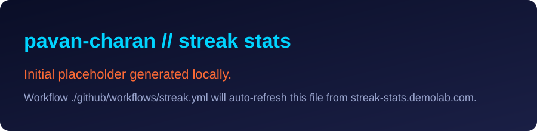

<h1 align="center">⚡ NEON GRID // Sai Satya Pavan Charan ⚡</h1>
<h3 align="center">Cyberpunk Builder · AI + Full Stack · India</h3>

  

  
  
  

---

## 🧠 About Me
- 👋 I am **Sai Satya Pavan Charan**.
- 🔭 Building practical products at the intersection of **AI, backend systems, and modern web apps**.
- 🌱 Currently leveling up in **Machine Learning** and **Deep Learning**.
- 🤝 Open to collaborations on ambitious, user-focused engineering projects.
- 📫 Reach me directly at **sspavancharan@gmail.com**.

## ⚙️ Tech Arsenal

  

## 📊 Live Metrics Deck

  
  

  

## 🕹️ Contribution Animations

  

  

---

  

